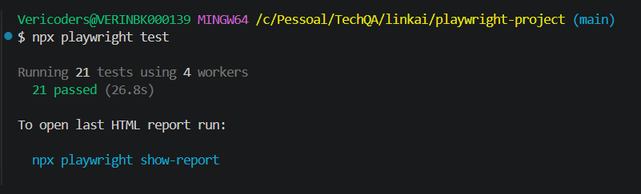
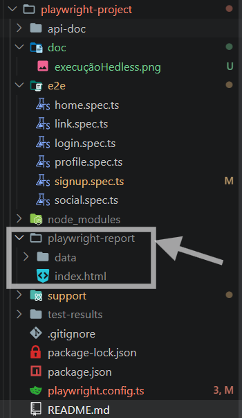
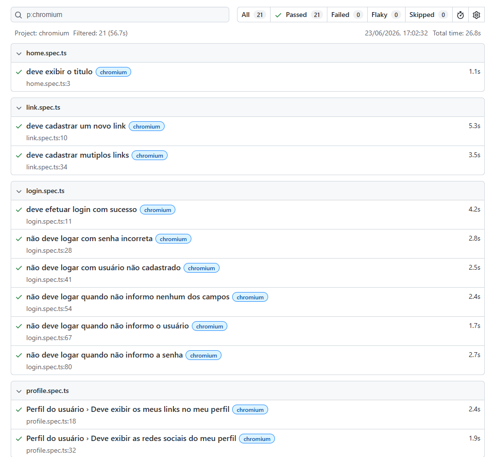
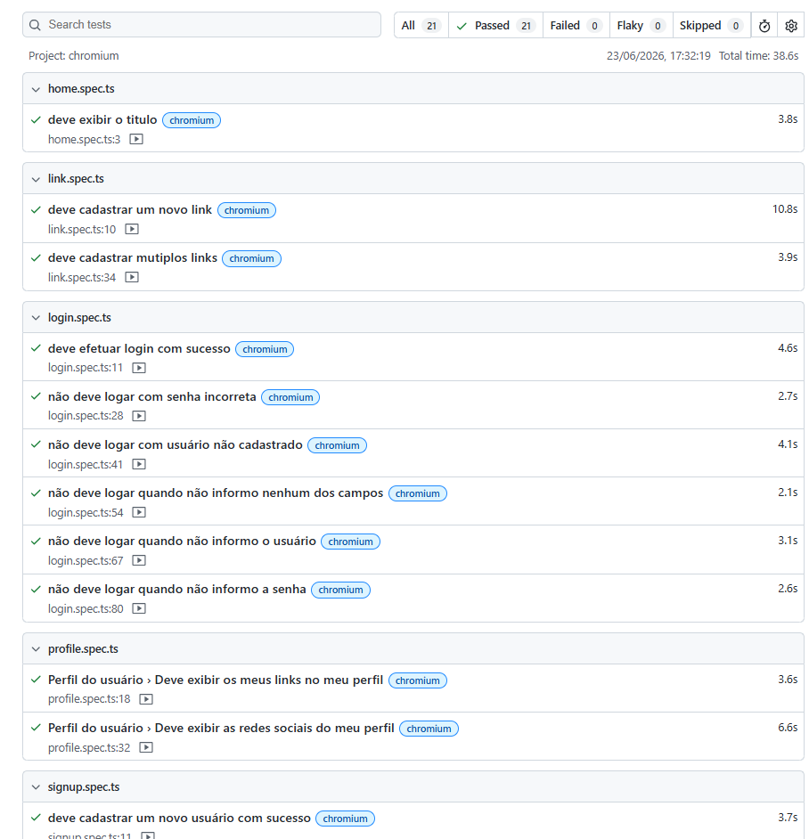
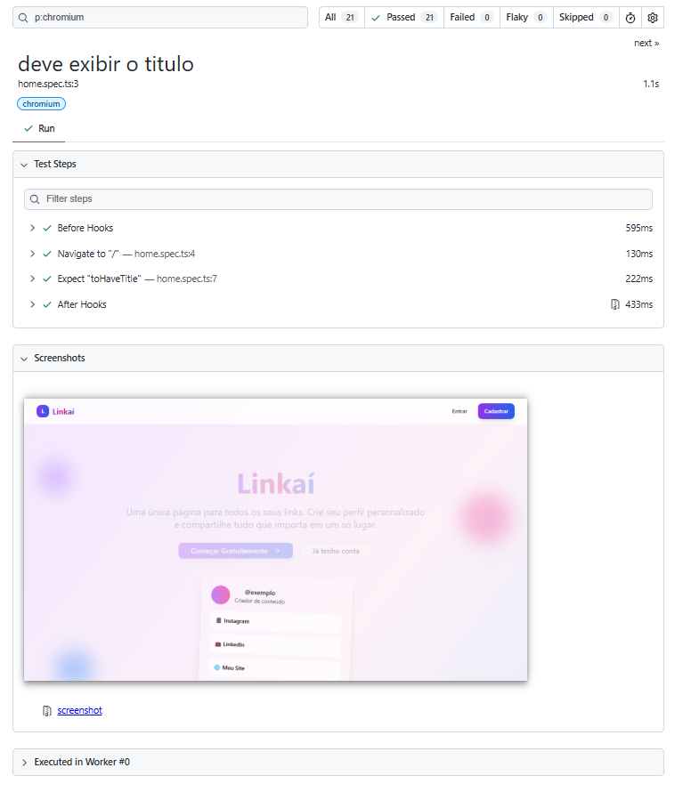
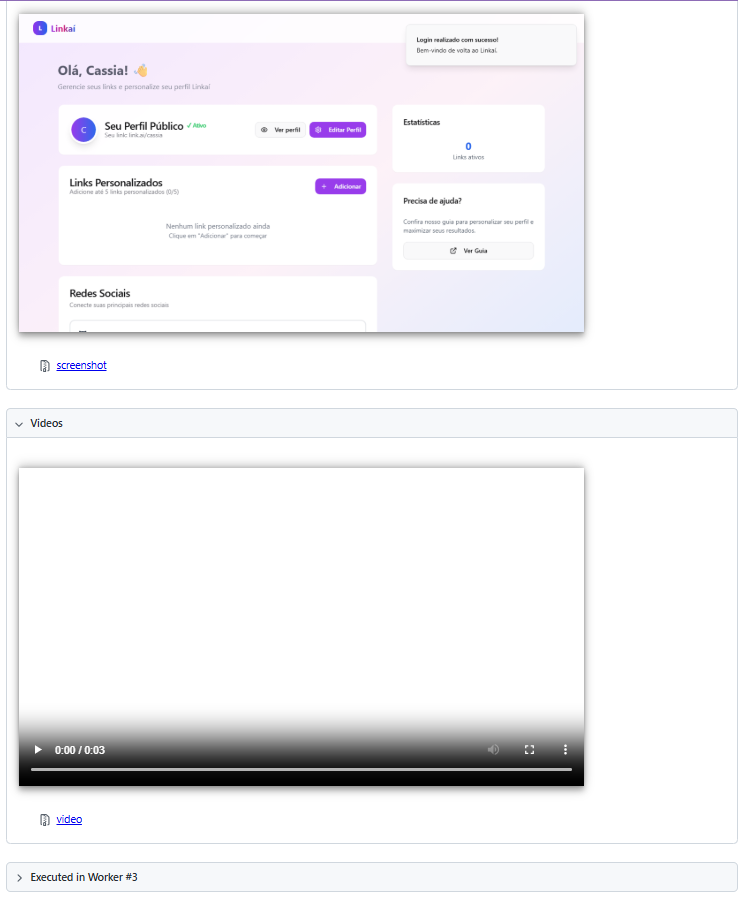

# 🎭 Linkaí - Jornada de Estudos em Automação com Playwright

## 📖 Sobre o Projeto

Este repositório contém a suíte de testes automatizados do projeto Linkaí, um gerenciador de links pessoais que integra uma API REST (**Node.js**), banco de dados NoSQL (**MongoDB**) e um Frontend Web (**React/Vite**).

O projeto contempla tanto testes End-to-End (E2E) da interface *WEB* quanto testes de *API*, utilizando **Playwright** e **TypeScript** para validação dos fluxos críticos da aplicação.

Além da automação dos cenários funcionais, foram aplicados conceitos de gerenciamento de massa de dados, integração com banco de dados, consumo de **APIs REST**, geração dinâmica de dados com **Faker.js**, criptografia de senhas com **bcryptjs** e utilização do **Bruno** para documentação e validação dos endpoints da API.

A preparação dos cenários é realizada através de operações de inserção e remoção de registros diretamente no **MongoDB**, garantindo independência e confiabilidade na execução dos testes.

A arquitetura do projeto evoluiu de um modelo tradicional baseado em **Page Objects** para uma abordagem orientada a *funcionalidades (Feature-Based Actions)*, além da implementação de uma camada voltada para consumo e validação de serviços da API.

Durante o desenvolvimento foram aplicados conceitos como:

- Automação E2E
- Automação de API
- TypeScript
- MongoDB
- Faker.js
- bcryptjs
- Data Driven Testing
- Feature-Based Actions
- Integração com Banco de Dados
- Consumo de APIs REST

---

## 🎯 Objetivo da Jornada

Este projeto foi utilizado como laboratório prático para consolidar conhecimentos em:

- Estruturação de projetos de automação
- Criação de testes E2E
- Criação de testes de API
- Gerenciamento de massa de dados
- Integração com banco de dados
- Componentização e reutilização de código
- Boas práticas de automação
- Estratégias para redução de manutenção dos testes

---

## 🚀 Principais Aprendizados

### ✅ Automação Web

- Login
- Cadastro de usuários
- Cadastro de links
- Cadastro de redes sociais
- Validações de interface
- Componentização de elementos

### ✅ Automação de API

- Consumo de endpoints REST
- Validação de respostas HTTP
- Validação de payloads
- Reutilização de serviços
- Criação de camada de acesso à API

### ✅ Gerenciamento de Dados

- Inserção de dados no MongoDB
- Remoção de dados para preparação de cenários
- Geração dinâmica de usuários com Faker.js
- Criptografia de senhas com bcryptjs

### ✅ Arquitetura

- Feature-Based Actions
- Data Driven Testing
- Tipagem forte com TypeScript
- Externalização de massa de testes
- Componentização

---

## 📈 Evolução Durante a Jornada

Ao longo do curso o projeto passou pelas seguintes evoluções:

| Etapa | Evolução |
|---------|---------|
| Módulo 05 | Primeiros testes com Playwright |
| Módulo 06 | Page Objects e gerenciamento de massa |
| Módulo 07 | Integração com MongoDB e independência dos testes |
| Módulo 08 | Testes de API, Arrays, Loops e serviços |

---

## 🛠 Tecnologias Utilizadas

- [Playwright](https://playwright.dev/)
- TypeScript
- [Node.js](https://nodejs.org/)
- [MongoDB](https://www.mongodb.com)
- [Faker.js](https://fakerjs.dev/)
- [bcryptjs](https://www.npmjs.com/package/bcryptjs)
- [Bruno](https://www.usebruno.com/)
- [Docker](https://www.docker.com/)

---

## 📚 O que este repositório representa

Este não é um framework corporativo ou produto final.

Ele representa minha evolução prática durante os estudos em automação de testes, servindo como registro dos conceitos aprendidos, experimentações realizadas e boas práticas aplicadas ao longo da Jornada TechQA.

---

## 📁 Estrutura do Projeto

```bash
playwright-project/
├── api-doc/                    # Documentação e coleções da API no Bruno
│   ├── Auth/
│   ├── environments/
│   ├── Links/
│   ├── social/
│   └── bruno.json
│
├── doc/                        # Documentação e imagens de apoio
│
├── e2e/                        # Scripts de testes automatizados
│   ├── home.spec.ts            # Testes E2E Web - Home
│   ├── link.spec.ts            # Testes E2E Web - Links
│   ├── login.spec.ts           # Testes E2E Web - Login
│   ├── profile.spec.ts         # Testes de API
│   ├── signup.spec.ts          # Testes E2E Web - Cadastro
│   └── social.spec.ts          # Testes E2E Web - Redes sociais
│
├── playwright-report/          # Relatórios HTML gerados após execução
│   ├── data/                   # onde se encontraram as evidencias (screenshot,videos)
│   │   ├── *.webm
│   │   └── *.png
│   └── index.html
│
├── support/
│   ├── actions/                # Ações por funcionalidade
│   │   ├── components/         # Componentes reutilizáveis
│   │   │   └── Toast.ts
│   │   ├── auth.ts
│   │   ├── link.ts
│   │   └── social.ts
│   │
│   ├── fixtures/               # Massa de testes
│   │   ├── profile.json
│   │   └── User.ts
│   │
│   ├── database.ts             # Conexão e manipulação do MongoDB
│   └── service.ts              # Camada de serviços da API
│
├── test-results/               # Evidências de falhas
├── package-lock.json
├── package.json
├── playwright.config.ts
└── README.md
```

---

## 🚀 Pré-requisitos para Execução

Antes de iniciar os testes, é necessário que o ambiente completo do **Linkaí** esteja rodando localmente.

### 1. Banco de Dados (Docker)
Na raiz da pasta `linkai/apps`, inicie os serviços de banco de dados:
```bash
docker-compose up -d
```

### 2. API (Backend)
Em um novo terminal, acesse `linkai/apps/api`:
```bash
npm install   # Caso seja a primeira execução
npm run dev
```

### 3. Web App (Frontend)
Em outro terminal, acesse `linkai/apps/web`:
```bash
npm install   # Caso seja a primeira execução
npm run dev
```
> A aplicação deverá estar disponível em: `http://localhost:3000`

---

## 🧪 Executando os Testes

Com a aplicação rodando, acesse a pasta `linkai/playwright-project` e utilize os comandos abaixo:

### Instalação de dependências do Playwright
```bash
npm install
npx playwright install --with-deps
```

### Comandos Principais
| Comando | Descrição |
| :--- | :--- |
| `npx playwright test` | Executa todos os testes em modo headless (sem interface) |
| `npx playwright test --headed` | Executa os testes exibindo o navegador |
| `npx playwright test --ui` | Abre a interface interativa do Playwright (recomendado) |
| `npx playwright test --debug` | Abre o Inspetor do Playwright para depuração passo a passo |
| `npx playwright show-report` | Abre o último relatório de testes gerado |
| `npx playwright codegen http://localhost:3000/login` | abre o navegador e o generator para gerar o teste |

---

## Visualização do Relatório da execução

para gerar o relatorio é necessário executar o comando:

### Execução da automação via hedless
```bash
npx playwright test
```
ou 
```bash
npx playwright show-report
```


### Relatório em HTML
Após a execução será gerado o relatório na pasta *\playwright-report*.<br>
**Obs.:** Nessa pasta também ficará armazenado os screenshots de todos os testes.<br>


### Apresentação do Relatório
Abrindo o relatório no navegador a visualização será essa:

Visuliação do relatório quando se tem video 


Ao clicar no caso de teste

Imagens do Detalhe do caso de teste tendo o screenshot e o Video para garantia da execução


---

## 📚 Material de Apoio

As anotações, resumos e conteúdos teóricos desta jornada estão centralizados no repositório:

👉 [jornada_TechQa](https://github.com/CassiaCaris/jornada_TechQa)

Este repositório contém apenas a implementação prática dos conceitos estudados durante a jornada.